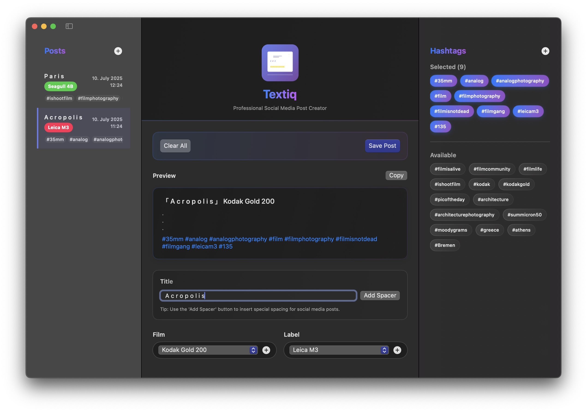

# Textiq - Professional Social Media Post Creator

<div align="center">
  
  <h3>Craft elegant social media descriptions with special formatting and hashtag management</h3>
  <p>
    
    
    
    
  </p>
</div>

A beautiful macOS application for crafting elegant social media descriptions with special formatting and hashtag management. Perfect for photographers, content creators, and social media professionals.

## 📱 Screenshot

<div align="center">
  
  <p><em>Textiq's clean interface with post history, editor, and film selection.</em></p>
</div>

## ✨ Features

### Core Functionality
- **Special Text Formatting**: Create posts with Japanese bracket formatting 「 」
- **Smart Spacing**: Add special Unicode spacing between words with one click
- **Film Type Selection**: Choose from a curated list of analog film types
- **Hashtag Management**: Create, organize, and reuse hashtags with visual buttons
- **Post History**: Collapsible sidebar showing all previously crafted posts
- **Real-time Preview**: See your post formatted exactly as it will appear

### User Experience
- **Three-Panel Layout**: Posts sidebar, main editor, and film selection sidebar
- **Collapsible Sidebars**: Toggle visibility of left and right panels
- **Modern SwiftUI Design**: Beautiful, responsive interface with smooth animations
- **Hover Effects**: Interactive hashtag buttons with remove functionality
- **Dark/Light Mode**: Automatic support for macOS appearance preferences

## 🖥️ System Requirements

- **macOS**: 14.0 (Sonoma) or later
- **Development**: Xcode 15.0 or later (for building from source)
- **Architecture**: Universal (Apple Silicon + Intel)

## 🚀 Quick Start

### Building from Source

1. **Clone the project**:
   ```bash
   git clone https://github.com/YOUR_USERNAME/Textiq.git
   cd Textiq
   ```

2. **Open in Xcode**:
   ```bash
   open Textiq.xcodeproj
   ```

3. **Build and run**:
   - Press `Cmd+R` to build and run
   - Or use `Product` → `Run`

## 📖 How to Use

1. **Create Title**: Enter your post title in the main editor
2. **Add Spacing**: Use the "Add Space" button for special Unicode spacing
3. **Select Film**: Choose from available film types or add custom ones
4. **Add Hashtags**: Click hashtag buttons to add them to your post
5. **Preview**: See real-time preview of your formatted post
6. **Save**: Save your post to the history sidebar
7. **Copy**: Copy the formatted post to clipboard

## 🏗️ Technical Architecture

### Core Components
- `TextiqApp.swift`: Application entry point and window configuration
- `ContentView.swift`: Main app layout and state management
- `MainEditorView.swift`: The central text editor component
- `SidebarView.swift`: Displays the list of saved posts
- `HashtagSidebarView.swift`: Manages hashtag selection and creation
- `PostModel.swift`: Data model for posts and hashtags

### Key Technologies
- **SwiftUI**: Modern reactive user interface
- **Combine**: For state management and data flow
- **UserDefaults**: For persisting posts and hashtags

## 🗂️ Project Structure

```
Textiq/
├── Textiq.xcodeproj/               # Xcode project configuration
├── Textiq/                         # Source code directory
│   ├── TextiqApp.swift            # Application entry point
│   ├── ContentView.swift            # Main UI view
│   ├── MainEditorView.swift         # Editor view
│   ├── SidebarView.swift            # Post history sidebar
│   ├── HashtagSidebarView.swift     # Hashtag management sidebar
│   ├── PostModel.swift              # Data models
│   └── Assets.xcassets/             # App icons and visual assets
├── docs/                            # Documentation and assets
│   └── assets/                      # Images, icons, and media files
└── README.md                        # This file
```

## 🤝 Contributing

Contributions are welcome! Please open an issue or submit a pull request.

1. Fork the repository
2. Create a feature branch (`git checkout -b feature/amazing-feature`)
3. Commit your changes (`git commit -m 'Add amazing feature'`)
4. Push to the branch (`git push origin feature/amazing-feature`)
5. Open a Pull Request

## 📄 License

This project is licensed under the MIT License.

---

<div align="center">
  <p><strong>Made with ❤️ for photographers and content creators</strong></p>
  <p>If you find Textiq useful, please consider ⭐ starring the repository!</p>
</div>